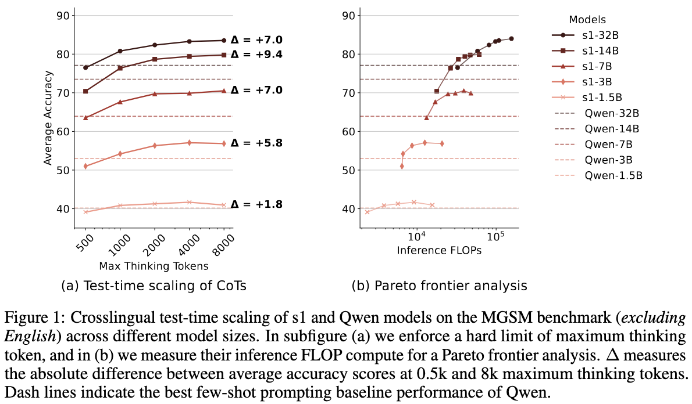

# Crosslingual Reasoning through Test-Time Scaling

<p align="center">
    <a href="https://arxiv.org/abs/xxx.xxxx"></a>
</p>

🔥 TL;DR: We show that scaling up thinking tokens of English-centric reasoning language models such as s1 can improve multilingual math reasoning performance. In addition, we analyze language-mixing patterns, performance of different reasoning languages through language forcing, and multilingual cross-domain generalization.

<p align="center">
  
</p>

---
### Quick Start

```bash
### installation (python 3.10+)
git clone https://github.com/BatsResearch/crosslingual-s1.git
cd crosslingual-s1
pip install -r requirements.txt
cd lm-evaluation-harness
pip install -e .[math,vllm]

### quick eval on 5 MGSM samples
cd ..
bash experiments/crosslingual_mgsm/eval_scripts/quick_eval_s1.sh
```

Note that we used the modified [lm_eval_harness](https://github.com/EleutherAI/lm-evaluation-harness) from [s1 repository](https://github.com/simplescaling/s1/). We further modify it for supporting our experimental setup.


### Structure
Our experimental codes are in the `experiments/` folder. We structure our repository according to the paper sections for easier reproducibility of our findings. We also provide the output generation artifacts.

- `crosslingual_mgsm`: Crosslingual test-time scaling experiments (Section 4)
- `language_mixing`: Language-mixing experiments (Section 5)
- `language_forcing`: Language-forcing experiments (Section 6)
- `crossdomain`: Cross-domain experiments (Section 7)
